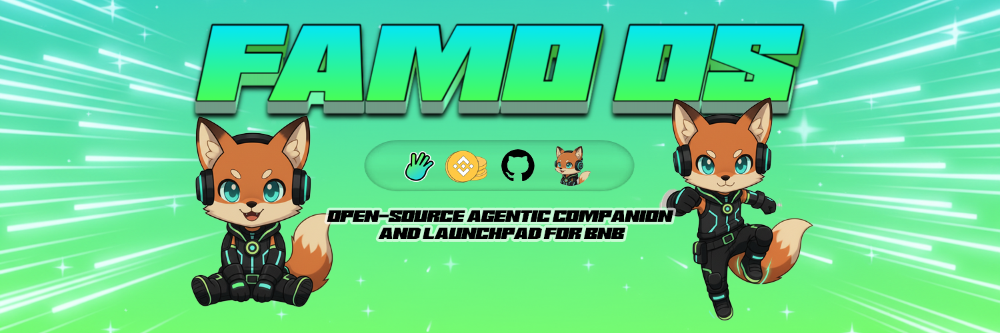

<div align="center">
  
</div>

Famo OS – Agentic Companion Launchpad Toolkit (v0.3 Alpha)
=========================================================

Famo OS is an open-source, agentic companion launchpad toolkit that fuses 3D companions, voice-first LLM interfaces, and on-chain intelligence. Spin up a bespoke 3D persona, wire in DeepSeek/OpenAI + Fish Audio, and prepare the agent to trade memes, detect bundles, and eventually deploy directly on four.meme. This is the foundation for a fully autonomous memecoin cockpit.

---

Project DNA
-----------

- **Agentic companion core** – expressive 3D character layer with idle/talk animations, audio playback, and personality scripting via XML.
- **Immersive surface** – Next.js + React Three Fiber scene with glassmorphic overlays, status telemetry, and background studio.
- **four.meme alignment** – roadmap includes bundle detection, holder analytics, and agentic launch flows.
- **Voice-ready conversations** – LLM routing (DeepSeek/OpenAI), persona injection, Fish Audio TTS, and a microphone CTA for future STT.
- **Open-source launchpad** – bring your own models, animations, APIs, and intelligence modules.

---

Core Capabilities
-----------------

| Module | Description |
| --- | --- |
| Companion surface | Load `idle.glb` & `talk.glb`, auto scale, center, and cross-fade animations |
| Personality scripts | Edit `config/persona.xml` to tweak tone, allegiances, and talking points |
| Chat/TTS pipeline | `/api/chat` proxies to DeepSeek/OpenAI, `/api/tts` wraps Fish Audio |
| Telemetry console | Top-right neon console shows status, version, and upcoming boosters |
| Background studio | Random color, color picker, custom image uploads, default `/public/bg.png` |
| Mic entry point | Prewired microphone button ready for future voice streaming |

---

Memecoin Mission
----------------

1. **Deploy companions** with custom skins, voice, and lore.
2. **Analyze markets** through upcoming ML + data plug-ins.
3. **Spot bundles** and suspicious flows before the crowd.
4. **Launch tokens** via planned four.meme integration.
5. **Report intelligently** with conspiratorial but upbeat tone.

---

Roadmap Highlights
------------------

### Companion Enhancements

- Memory + persistent brain (database-backed context)
- Advanced personality layering and lore engines
- Expanded default 3D roster plus text-to-rig generator
- Speech-to-text microphone integration
- Multi-agent scenes with director controls

### Memecoin Intelligence

- Bundle watch dashboards & alerts
- Holder forensics and loyalty scoring
- ML pattern detection for early momentum
- Agentic four.meme creation and auto-liquidity flows
- Alpha feed aggregation across social + on-chain
- Risk copilot with compliance toggles
- Narrative pack generator for token launches

---

Version Roadmap
----------------

| Version | Status | Highlights |
| --- | --- | --- |
| 0.3 Alpha | Current | 3D companion core, persona stack, TTS, UI glassmorphism, telemetry |
| 0.4 Alpha | In progress | Voice input pipeline, data plug-ins, deeper status console |
| 0.5 Beta | Planned | Bundle detection, holder analytics, persona memory |
| 0.6 Beta | Planned | four.meme launch flows, 3D generator integration |
| 1.0 | Future | Full agentic memecoin cockpit with ML copilots |

---

Getting Started
---------------

1. Clone the repo and `npm install`.
2. Place your rigged models in `public/idle.glb` and `public/talk.glb`.
3. Create `.env.local`:

   ```bash
   OPENAI_API_KEY=...
   DEEPSEEK_API_KEY=...
   FISH_AUDIO_API_KEY=...
   MURF_API_KEY=...            # only if using Murf
   MURF_VOICE_ID=en-UK-ruby    # optional voice override
   LLM_PROVIDER=openai   # or deepseek
   TTS_PROVIDER=fish      # fish or murf
   ```

4. Run the dev server:

   ```bash
   npm run dev
   ```

5. Visit [http://localhost:3000](http://localhost:3000) to meet your Famo agent.

---

Contribution Playbook
---------------------

- Fork, branch, and PR with descriptive commits.
- Drop new GLB assets in `public/`, wire them via `FoxModel.tsx`.
- Extend `config/persona.xml` with alternate personalities.
- Integrate real-time market data or ML models into telemetry.
- Share forks, demo clips, or companion lore with the community.
- Read the full [Open Source Playbook](docs/OPEN_SOURCE.md) for contribution philosophy and expectations.

---

License
-------

Famo OS ships under the MIT License. See [LICENSE](LICENSE).

Let the fox lead you into the next meme frontier.
